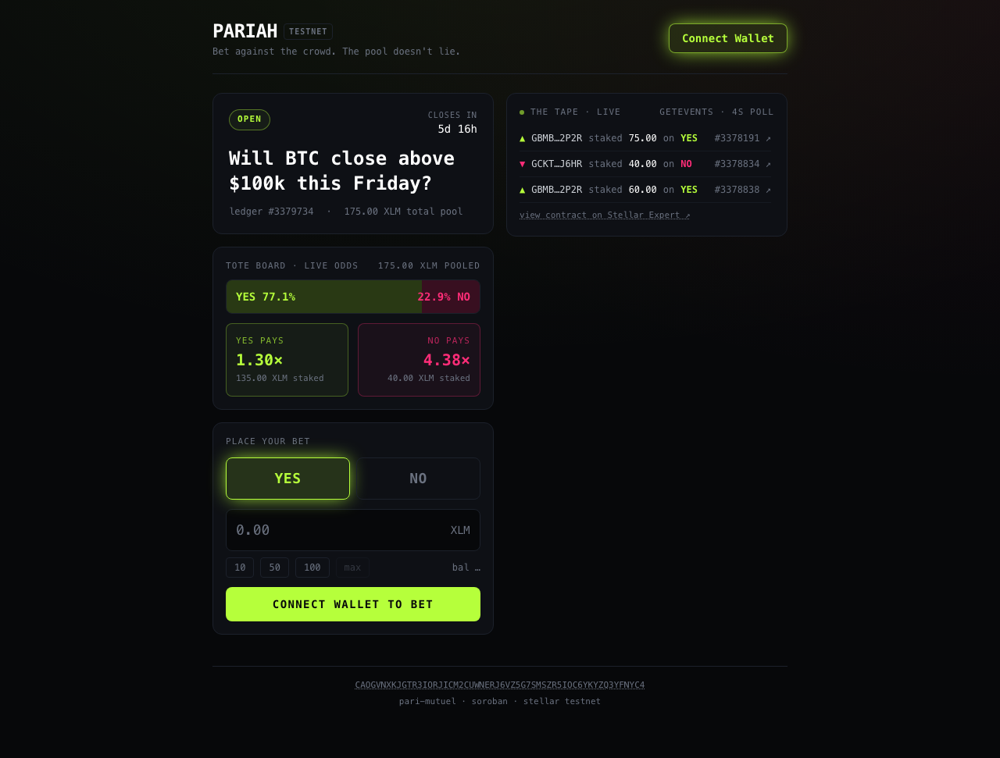
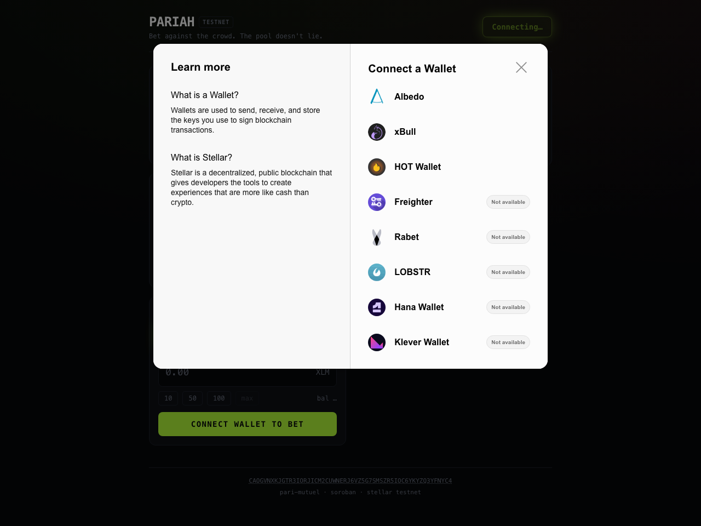

# PARIAH 🎲

### An on-chain, real-time **pari-mutuel prediction market** on Stellar.

> **Bet against the crowd. The pool doesn't lie.**

### ▶️ Live demo: **https://pariah-ten.vercel.app**

<sub>Auto-deploys to Vercel on every push to `main` (project root: `app/`).</sub>

Users stake real testnet **XLM** on **YES / NO** of a binary question
(_"Will BTC close above $100k this Friday?"_). The odds aren't set by a
bookmaker — they're derived **live from the on-chain pools**, pari-mutuel style,
exactly like a racetrack tote board or Polymarket. Every bet emits a contract
event; the frontend streams those events into a live **TAPE** feed and
re-computes implied odds in real time, flashing a **🔥 STEAM** animation when a
pool jumps fast. The admin resolves the outcome, and winners `claim()` their
proportional slice of the entire pool.

One project that is simultaneously a **live poll** (with money), an **activity
feed**, a **leaderboard** of stakers, **real-time progress bars**, and a
**multi-address payment tracker**.



---

## 🟡 Yellow Belt requirement → feature map

| # | Requirement | How PARIAH satisfies it |
|---|-------------|--------------------------|
| 1 | **Multi-wallet** (StellarWalletsKit) | Freighter · xBull · Albedo · LOBSTR · Rabet · Hana · Klever via one modal — see [wallet screenshot](docs/wallet-modal.png) |
| 2 | **3+ error types** | (a) wallet not installed / rejected, (b) insufficient XLM balance (pre-check), (c) market closed / already-resolved (decoded contract errors), (d) RPC / simulation / network failure — all with toast + inline copy (`src/lib/errors.ts`) |
| 3 | **Contract deployed on testnet** | Soroban pari-mutuel contract, staking real XLM via the native Stellar Asset Contract |
| 4 | **Contract called from frontend** | `bet()` / `resolve()` / `claim()` built, simulated, signed via wallet & submitted (`src/lib/stellar.ts`) |
| 5 | **Read + write data** | **Write:** `bet`. **Read:** `get_market` / `get_stake` polled every 5s for state sync |
| 6 | **Event listening / state sync** | RPC `getEvents` polled every 4s → live TAPE feed + live odds recompute (`src/hooks/useEvents.ts`) |
| 7 | **Transaction status** (pending/success/fail) | Full lifecycle tracker: `BUILDING → SIGNING → SUBMITTING → PENDING → SUCCESS/FAILED` with Stellar Expert hash link (`src/components/TxTracker.tsx`) |
| 8 | **2+ meaningful commits** | ① contract + tests → ② multi-wallet frontend, live tape, tx tracker → ③ docs (7 commits total) |

### 👛 Wallet options (StellarWalletsKit multi-wallet modal)

Clicking **Connect Wallet** opens the StellarWalletsKit modal listing every
supported wallet — Freighter, xBull, Albedo, LOBSTR, Rabet, Hana, Klever:



---

## 🔗 Deployed on Stellar Testnet

| Thing | Value |
|-------|-------|
| **Contract ID** | [`CAOGVNXKJGTR3IORJICM2CUWNERJ6VZ5G7SMSZR5IOC6YKYZQ3YFNYC4`](https://stellar.expert/explorer/testnet/contract/CAOGVNXKJGTR3IORJICM2CUWNERJ6VZ5G7SMSZR5IOC6YKYZQ3YFNYC4) |
| **Admin** | `GBMB2FZK5JTPO7AKAAHQI7VNYICAGPWCVZ5LQ64AEHF3KGLKAFGT2P2R` |
| **Stake token** | native XLM SAC — `CDLZFC3SYJYDZT7K67VZ75HPJVIEUVNIXF47ZG2FB2RMQQVU2HHGCYSC` |
| **WASM hash** | `30bc13498c6ee9101770804b8c30ccde324f267c212d9a4dc044092605b063f4` |
| **Live app** | https://pariah-ten.vercel.app |

### Verifiable transaction hashes (contract calls)

| Call | Hash / Stellar Expert |
|------|------------------------|
| **Deploy** | [`a5a0cbc3…b805b8`](https://stellar.expert/explorer/testnet/tx/a5a0cbc30a2d338809115b285489fe2515d15042c736aa07ee866ebc8cb805b8) |
| **initialize** | [`caaad41d…4be7`](https://stellar.expert/explorer/testnet/tx/caaad41d9b2f565dde8b3d784bbe58d6ac6e1a2d11e68679bca0bc5a9a2e4be7) |
| **bet** — 75 XLM on YES | [`a53278c2…a6347`](https://stellar.expert/explorer/testnet/tx/a53278c29149f8f83658866eebc3ec7abf8c5952a3c3049b51299b7535fa6347) |
| **bet** — 40 XLM on NO | [`c8e5636d…142a6`](https://stellar.expert/explorer/testnet/tx/c8e5636dd46669f5f3e2bf72c238f9037095807506729c4227432bd5177142a6) |
| **bet** — 60 XLM on YES | [`6fe881af…e2db`](https://stellar.expert/explorer/testnet/tx/6fe881af767a35e0945047b4a3400c7de0bf6d9086787bced46eec0fcfa6e2db) |

> These three `bet` calls seeded the live market to **135 XLM YES / 40 XLM NO**
> (implied **YES 77.1%**). Placing another bet from the UI produces your own
> hash — grab it from the transaction tracker's Stellar Expert link.

---

## 🧠 How it works

```
                 ┌──────────────── Next.js 14 frontend (client-only) ────────────────┐
   wallet    →   │  StellarWalletsKit ──► build tx ──► simulate/prepare ──► sign      │
 (Freighter,     │      │                                                    │        │
  xBull, …)      │      ▼                                                    ▼        │
                 │  useMarket (poll get_market / get_stake, 5s)     submit + poll tx   │
                 │  useEvents (poll getEvents, 4s) ──► TAPE + STEAM odds recompute     │
                 └───────────────────────────────┬───────────────────────────────────┘
                                                 │  Soroban RPC (soroban-testnet.stellar.org)
                                                 ▼
                 ┌──────────── Soroban contract (Rust) ────────────┐
                 │  bet()      → transfer XLM in, grow pool, emit   │
                 │  resolve()  → admin sets outcome, emit          │
                 │  claim()    → winning_stake · total / winning   │
                 │  get_market / get_stake  (read-only)            │
                 └─────────────────────────────────────────────────┘
```

**Pari-mutuel math.** Odds come purely from the pools:

- implied `YES% = pool_yes / (pool_yes + pool_no)`
- decimal odds `YES = total_pool / pool_yes` (the payout multiple)
- a winner's payout `= your_winning_stake × total_pool / winning_pool`

Soroban has **no websockets** — polling `getEvents` is the intended real-time
pattern, so the 4-second event loop is idiomatic, not a workaround.

---

## 📜 Contract API (`contract/contracts/pariah/src/lib.rs`)

| Function | Description |
|----------|-------------|
| `initialize(admin, stake_token, question, close_ledger)` | One-time setup |
| `bet(better, side, amount)` | `require_auth`, transfer XLM in, grow the pool, emit `bet` event |
| `resolve(outcome)` | Admin-only, after close; sets the winning side, emits `resolve` |
| `claim(better)` | After resolution; pays proportional slice, guards double-claim |
| `get_market() -> Market` | question, pools, close_ledger, resolved, outcome, … |
| `get_stake(user, side) -> i128` | a user's stake on one side |
| `has_claimed(user) -> bool` | claim guard state |

Custom `#[contracterror]` variants: `MarketClosed`, `AlreadyResolved`,
`NotResolved`, `ZeroAmount`, `AlreadyClaimed`, `NotAdmin`, `NothingToClaim`,
`TooEarly`, `AlreadyInitialized`, `NotInitialized`.

**Tests** (`cargo test`, 8 passing) cover pool accounting, the payout math,
double-claim / closed-market / early-resolve guards, and loser-has-nothing.

---

## 🚀 Run it locally

### Prerequisites
```bash
brew install stellar-cli           # Stellar CLI (>= 22; this build used 27)
rustup target add wasm32v1-none    # wasm compile target
```

### 1. Contract — build, test, deploy
```bash
cd contract
cargo test                         # 8 unit tests
cd ..
./scripts/deploy.sh                # build + deploy + initialize, prints env vars
```

### 2. Frontend
```bash
cd app
cp .env.example .env.local         # paste the values printed by deploy.sh
npm install
npm run dev                        # http://localhost:3000
```

Connect a wallet (Freighter is easiest on testnet), pick **YES** or **NO**,
enter an amount, and watch the tote board + tape update live as the bet lands.

---

## ⚠️ Error handling (all user-visible: toast + inline)

| Case | What the user sees |
|------|--------------------|
| Wallet not installed / rejected | _"That wallet isn't installed…"_ / _"You cancelled the request…"_ |
| Insufficient XLM (pre-check before signing) | _"Insufficient balance (keep ~1.5 XLM for fees)."_ |
| Market closed / already resolved | Decoded from the contract error → _"This market is closed…"_ |
| RPC / simulation / network failure | _"Network error talking to the Stellar RPC. Please retry."_ + retry button |

---

## 🧱 Stack

- **Contract:** Rust + `soroban-sdk` 26, Soroban on Stellar testnet
- **Frontend:** Next.js 14 (App Router) · TypeScript · TailwindCSS
- **Wallets:** `@creit.tech/stellar-wallets-kit` (multi-wallet)
- **SDK:** `@stellar/stellar-sdk` 13 (build / simulate / submit / getEvents)

## 🗂 Layout
```
pariah/
├── contract/          # Soroban workspace (Rust)
│   └── contracts/pariah/src/{lib.rs,test.rs}
├── app/               # Next.js 14 frontend
│   └── src/{lib,hooks,components,app}
├── scripts/deploy.sh  # build + deploy + initialize
└── docs/              # screenshots
```
